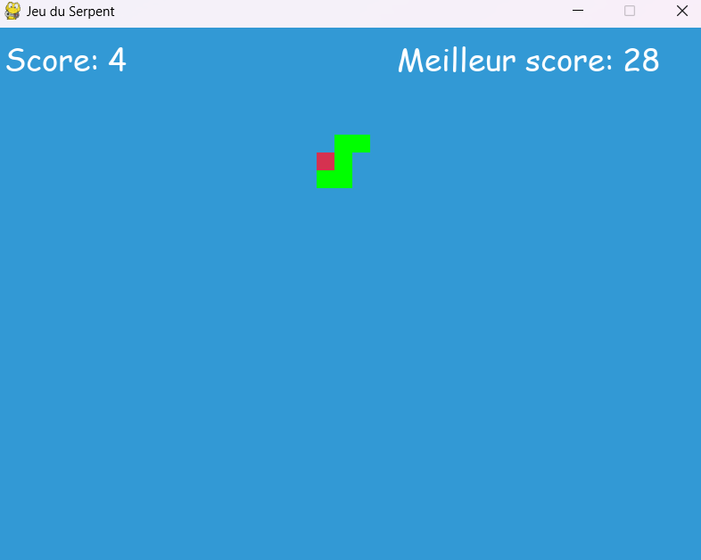

# Jeu du serpent

Ce jeu met en œuvre les fonctionnalités de base du jeu du serpent : le serpent se déplace, mange de la nourriture pour grandir, et le jeu se termine si le serpent touche les bords ou se mord lui-même.

